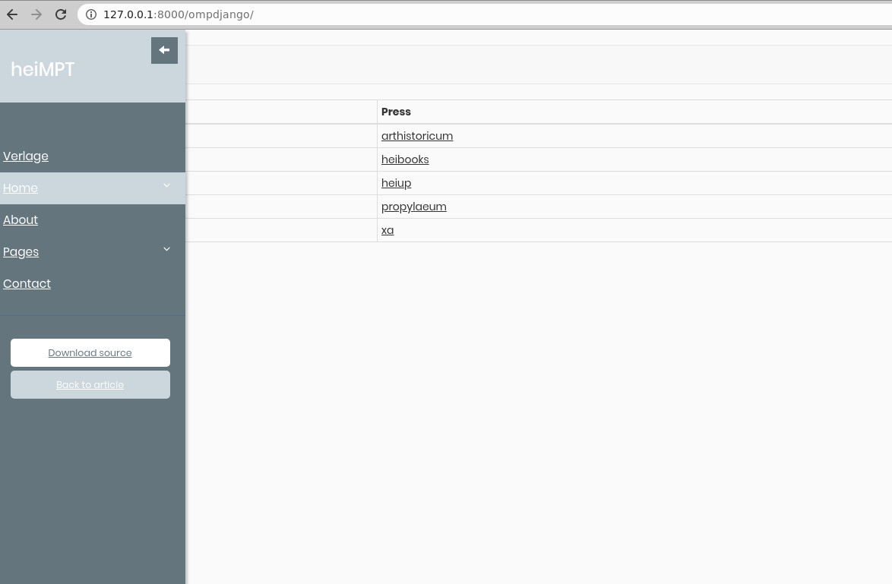

# Introduction
This is a sample application for mapping of OMP Database into the python django-model.a



# Installation


```bash
sudo pip3 install -r requirements.txt
sudo python3 setup.py install
cd $INSTALLATION_FOLDER
```

Run 
```bash
python3 manage.py runserver
```

